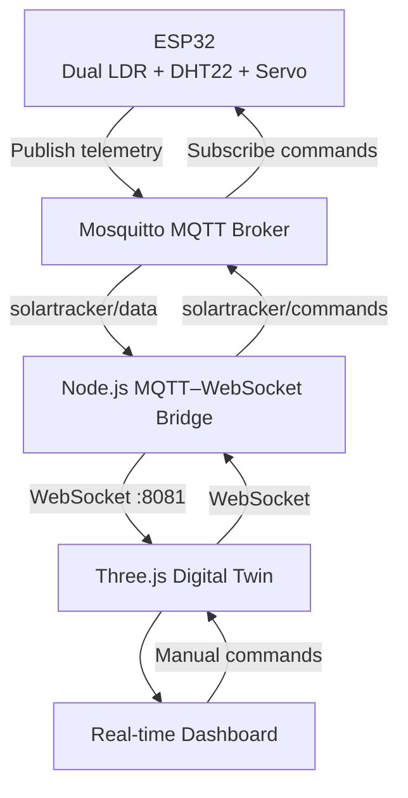

# Solar Tracker Digital Twin

[](https://www.espressif.com/en/products/socs/esp32)
[](https://www.arduino.cc/)
[](https://mosquitto.org/)
[](https://threejs.org/)
[](https://nodejs.org/)
[](https://developer.mozilla.org/docs/Web/JavaScript)
[](https://vite.dev/)

An IoT-enabled **Solar Tracker Digital Twin** that connects a physical, ESP32-based dual-LDR tracker to an interactive browser experience. MQTT telemetry is relayed through a Node.js WebSocket bridge, driving a Three.js tracker model, simulated sun, environmental labels, and a responsive control dashboard in real time.

> **Repository scope:** This repository contains the web digital twin and MQTT/WebSocket bridge. ESP32 firmware and its GPIO assignments are not currently included, so the hardware-facing sections identify the required integration contract without inventing unavailable details.

---

## Features

- ☀️ Automatic solar tracking telemetry from dual LDR sensors
- 🎛️ Manual tracking mode with a dashboard angle slider
- 🦾 Real-time servo-angle visualization on the 3D panel
- 🌡️ Live DHT22 temperature monitoring
- 💧 Live DHT22 humidity monitoring
- 📡 MQTT telemetry ingestion through Mosquitto
- 🔌 Browser-to-device commands over WebSocket and MQTT
- 🧊 Three.js digital twin with separate base, panel, and DHT22 models
- 📊 Real-time dashboard for tracking state and sensor values
- 🌞 Hardware-driven sun simulation and night-mode lighting
- 📈 Live LDR, balance, angle, temperature, and humidity telemetry
- 📱 Responsive, collapsible dashboard UI

## Technologies Used

### Hardware

| Technology | Role |
| --- | --- |
| ESP32 | Wi-Fi-enabled controller expected to publish telemetry and receive commands. |
| Servo motor | Adjusts the physical panel angle reported as `angle`. |
| Dual LDR sensors | Compare left and right light levels for solar alignment. |
| DHT22 | Supplies temperature and relative-humidity readings. |

### Software

| Technology | Role |
| --- | --- |
| Vite | Frontend development server and production build tool. |
| Node.js | Runs the MQTT-to-WebSocket bridge. |
| Mosquitto | MQTT broker used by the bridge at `mqtt://localhost:1883`. |
| WebSocket | Delivers telemetry to the browser and returns control commands. |
| HTML / CSS / JavaScript | Dashboard structure, styling, and application logic. |

### Libraries

| Library | Use in this project |
| --- | --- |
| [Three.js](https://threejs.org/) | Scene, renderer, lighting, models, and panel rotation. |
| `GLTFLoader` | Loads the tracker, panel, base, and DHT22 GLB assets. |
| `OrbitControls` | Lets users inspect the digital twin in 3D. |
| `CSS2DRenderer` | Renders live angle and DHT22 labels in the scene. |
| [mqtt](https://www.npmjs.com/package/mqtt) | Connects the bridge to Mosquitto. |
| [ws](https://www.npmjs.com/package/ws) | Hosts the bridge WebSocket server. |
| [SunCalc](https://www.npmjs.com/package/suncalc) | Calculates sun position for the visual simulation. |

## System Architecture



### Data flow

1. The ESP32 samples the LDRs and DHT22, determines tracking state, and publishes JSON telemetry.
2. Mosquitto accepts the payload on `solartracker/data`.
3. `bridge/bridge.js` forwards the payload unchanged to every connected WebSocket client.
4. `src/main.js` updates the panel angle, sun state, in-scene labels, and dashboard.
5. Manual dashboard changes travel in the opposite direction as JSON commands on `solartracker/commands`.

## Project Structure

```text
sun-tracker/
├── bridge/
│   ├── bridge.js              # MQTT subscriber/publisher and WebSocket server (:8081)
│   ├── package.json           # Bridge dependencies: mqtt and ws
│   └── package-lock.json
├── public/
│   └── models/
│       ├── Base.glb           # Tracker base model
│       ├── Panel.glb          # Animated panel model
│       ├── dht22_lowpoly.glb  # Environmental-sensor model
│       └── model.glb          # Additional combined tracker asset
├── src/
│   ├── main.js                # Three.js scene, WebSocket client, and telemetry updates
│   ├── sun.js                 # Sun simulation and hardware-angle sun mapping
│   ├── ui.js                  # Dashboard and manual-control UI
│   ├── style.css              # Scene and shared visual styling
│   └── ui.css                 # Dashboard styling
├── index.html                 # Vite entry document
├── package.json               # Frontend scripts and dependencies
└── README.md
```

<details>
<summary><strong>Key file responsibilities</strong></summary>

| Path | Responsibility |
| --- | --- |
| `bridge/` | Moves MQTT messages between the broker and WebSocket clients. |
| `public/models/` | Publicly served GLB assets loaded by the Three.js application. |
| `src/` | Browser application source code. |
| `src/main.js` | Creates the scene, connects to `ws://localhost:8081`, and applies received telemetry. |
| `src/sun.js` | Renders the sun path and maps tracker angle to a simulated sun position. |
| `src/ui.js` | Creates the dashboard, telemetry cards, mode controls, and manual angle slider. |
| `src/style.css` | Styles the canvas and shared visual elements. |
| `package.json` | Defines `dev`, `build`, and `preview` Vite scripts. |
</details>

## Hardware Components

| Component | Purpose in the tracker |
| --- | --- |
| **ESP32** | Reads sensors, controls the servo, connects to Wi-Fi, and exchanges MQTT messages. |
| **Servo motor** | Tilts the solar panel; its position is represented by the telemetry `angle` field. |
| **Left LDR** | Measures light on the left side of the panel and contributes `left` telemetry. |
| **Right LDR** | Measures light on the right side of the panel and contributes `right` telemetry. |
| **DHT22** | Reports `temperature` in °C and `humidity` as a percentage. |
| **Solar panel / tracker frame** | The physical mechanism mirrored by the digital twin. |

## Software Components

| Component | Responsibility |
| --- | --- |
| **ESP32 firmware** | Expected to read the sensors, drive the servo, publish `solartracker/data`, and consume `solartracker/commands`. Firmware is not committed in this repository. |
| **MQTT broker** | Mosquitto routes device telemetry and command messages. The bridge is configured for a local broker on port `1883`. |
| **Node.js bridge** | Subscribes to telemetry, broadcasts it to WebSocket clients, and publishes browser commands to MQTT. |
| **Three.js renderer** | Loads the GLB assets, renders lighting and shadows, rotates the panel, and shows data labels. |
| **Dashboard** | Displays sun state, connection status, mode controls, and live telemetry cards. |
| **WebSocket communication** | Uses `ws://localhost:8081` to synchronize browser state with the bridge. |

## Hardware Connections

The committed application defines the telemetry and command interface, but it does **not** include an ESP32 sketch or schematic. Therefore exact GPIOs cannot be verified from this repository. Use the firmware's configured pins as the source of truth before wiring hardware.

| Device | ESP32 connection | Signal / notes |
| --- | --- | --- |
| ESP32 | — | Main controller and Wi-Fi/MQTT client. |
| Servo motor | **Firmware-defined GPIO** | Signal pin plus a suitable external 5 V supply and common ground. Do not power a servo from an ESP32 GPIO pin. |
| Left LDR | **Firmware-defined ADC GPIO** | Typically read through a voltage divider; publishes the `left` value. |
| Right LDR | **Firmware-defined ADC GPIO** | Typically read through a voltage divider; publishes the `right` value. |
| DHT22 | **Firmware-defined digital GPIO** | Data pin requires the wiring/pull-up arrangement specified by the selected DHT22 module. |

> ⚠️ Confirm voltage levels, shared ground, servo current capacity, and the firmware's exact GPIO constants before connecting the prototype. This README intentionally does not assign pins that are absent from the tracked source.

## Installation

### Prerequisites

- Node.js and npm
- A running Mosquitto broker reachable by the bridge
- An ESP32 tracker firmware implementation compatible with the topics and JSON contract below

### 1. Clone the repository

```bash
git clone <your-repository-url>
cd sun-tracker
```

### 2. Install frontend dependencies

```bash
npm install
```

### 3. Start the Vite frontend

```bash
npm run dev
```

Open the local URL printed by Vite (commonly `http://localhost:5173`).

### 4. Install bridge dependencies

In another terminal:

```bash
cd bridge
npm install
```

### 5. Run the MQTT–WebSocket bridge

```bash
node bridge.js
```

The bridge listens on `ws://localhost:8081` and connects to `mqtt://localhost:1883` by default.

### 6. Upload ESP32 firmware

Upload your ESP32 firmware after configuring:

- Wi-Fi SSID and password
- MQTT broker IP address or hostname
- MQTT port and any authentication settings
- The GPIO assignments for the servo, both LDRs, and DHT22
- The `solartracker/data` and `solartracker/commands` topic names

The ESP32 firmware is not included in this repository; it must emit the telemetry schema expected by the frontend and bridge.

<details>
<summary><strong>Production frontend build</strong></summary>

```bash
npm run build
npm run preview
```

Vite writes the production bundle to `dist/`. If deploying beyond localhost, update the hard-coded WebSocket URL in the application and the bridge's broker connection to match the target environment.
</details>

## Dashboard

The browser dashboard is rendered alongside the 3D scene and can be collapsed when a larger model view is needed.

| Area | What it shows or controls |
| --- | --- |
| **Sun Tracking** | Sun elevation, azimuth, and a current tracking-status label. |
| **Tracking Control** | Auto/Manual mode selection and a manual angle slider from `-30°` to `30°`. |
| **Live Telemetry** | Servo angle, left/right LDR values, balance, temperature, and humidity. |
| **Connection Status** | Dashboard status, last update, ESP32 label, MQTT broker status, and WebSocket label. |

In manual mode, the dashboard sends either of these JSON command shapes through the WebSocket bridge:

```json
{ "command": "SET_MODE", "mode": "MANUAL" }
```

```json
{ "command": "SET_ANGLE", "angle": 15 }
```

## Digital Twin

The digital twin uses Three.js to mirror the tracker's reported state rather than simulating an independent controller.

- **Solar tracker model:** Separate `Base.glb` and `Panel.glb` assets form the rendered assembly.
- **Animated panel:** The scene finds the panel object named `panel` and rotates it on the X axis using incoming `angle` data.
- **DHT22 model:** `dht22_lowpoly.glb` appears beside the tracker with a floating temperature/humidity label.
- **Sun simulation:** A sun mesh, glow, dashed sun path, and directional light visualize the tracker’s operating context.
- **Live labels:** CSS2D labels display the current panel angle and DHT22 measurements in the 3D scene.
- **Real-time synchronization:** Each bridge message updates the model, sun visibility, dashboard sensor cards, tracking mode, and connection labels.

## MQTT Topics

| Topic | Direction | Purpose |
| --- | --- | --- |
| `solartracker/data` | ESP32 → broker → bridge → browser | Publishes tracker telemetry as JSON. The bridge subscribes to this topic. |
| `solartracker/commands` | Browser → bridge → broker → ESP32 | Carries dashboard commands such as mode changes and manual angles. |

The bridge does not transform messages: it forwards telemetry payloads to connected browsers and publishes browser messages to the command topic.

## JSON Telemetry Example

Publish telemetry to `solartracker/data` in JSON format:

```json
{
  "left": 920,
  "right": 1025,
  "temperature": 25.7,
  "humidity": 52.8,
  "average": 972,
  "normalized": -0.054,
  "direction": "RIGHT",
  "angle": 15,
  "moving": true,
  "auto": true
}
```

| Field | Type | Meaning |
| --- | --- | --- |
| `left` | number | Raw or scaled reading from the left LDR. |
| `right` | number | Raw or scaled reading from the right LDR. |
| `temperature` | number | DHT22 temperature in degrees Celsius. |
| `humidity` | number | DHT22 relative humidity as a percentage. |
| `average` | number | Combined light reading, typically derived from the two LDR values. |
| `normalized` | number | Normalized left/right imbalance; the dashboard presents it as a percentage balance. |
| `direction` | string | Tracking direction/status, expected by the UI as `LEFT`, `RIGHT`, `CENTER`, or `NIGHT`. |
| `angle` | number | Servo/panel angle in degrees; used to rotate the panel and position the simulated sun. |
| `moving` | boolean | Whether the physical tracker is currently moving. Included in the device payload for state awareness. |
| `auto` | boolean | `true` for automatic tracking; `false` for manual operation. |

## Screenshots

> Add project screenshots here when available. Placeholders intentionally avoid assuming asset names or paths.

### Physical Prototype

`[Insert photograph of the ESP32, sensors, servo, and panel prototype]`

### Digital Twin

`[Insert screenshot of the Three.js solar tracker model and sun simulation]`

### Dashboard

`[Insert screenshot of the dashboard with live status and telemetry]`

### Manual Mode

`[Insert screenshot of manual mode and the angle control slider]`

### Live Telemetry

`[Insert screenshot showing incoming LDR and DHT22 telemetry]`

## Future Enhancements

- ☁️ Cloud deployment for remote monitoring
- 🗃️ Historical telemetry storage and trend charts
- 📲 Mobile application or mobile-first operator view
- 🌦️ Weather API integration for environmental context
- 🤖 AI-assisted sun-position and yield prediction
- 🧩 Multiple tracker support for array or solar-farm monitoring
- ⚡ Energy-generation analytics with voltage, current, and power sensors
- 🔔 Alerting for sensor faults, communication loss, and out-of-range conditions

## License

MIT License. Add a `LICENSE` file containing the MIT license text before distributing the project under this license.

## Author

Built and maintained by **[Your Name]**.

- GitHub: [@your-github-username](https://github.com/your-github-username)
- LinkedIn: [Your LinkedIn Profile](https://www.linkedin.com/in/your-linkedin-username/)

---

If you use this project in a portfolio, replace the author and repository placeholders and add screenshots of your physical prototype and deployed dashboard.
